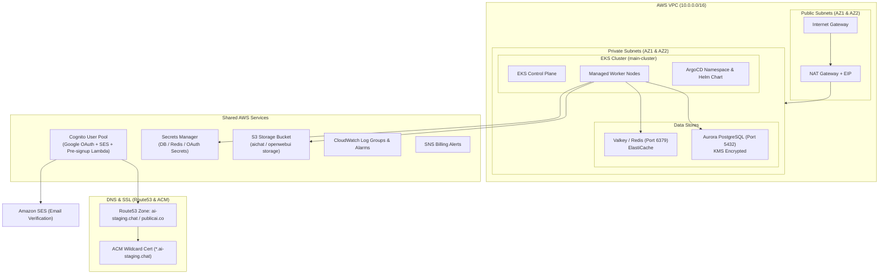
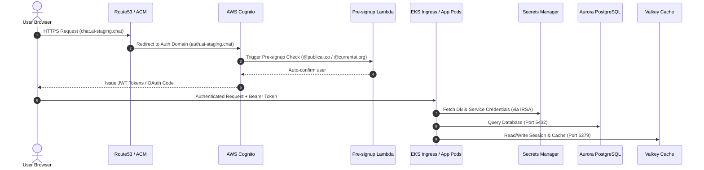

# 🗺️ Terraform Infrastructure Architecture Map

Visual map and reference guide for all Terraform configurations in this repository.

---

## 📂 Directory & State Architecture

```
                               ┌────────────────────────────────┐
                               │     terraform-remote-state/    │
                               │  - S3 State Bucket             │
                               │  - DynamoDB Lock Table         │
                               │  - Base Route53 Hosted Zone    │
                               └──────────────┬─────────────────┘
                                              │ Boostraps Backend
                                              ▼
┌─────────────────────────────────┐        ┌────────────────────────────────┐
│        terraform_import/        │        │           terraform/           │
│  - Imports existing AWS Aurora  │        │  Main Infrastructure Stack:    │
│  - Imports Valkey Serverless    │───────►│  - VPC, Subnets, IGW, NAT      │
│  - Imports Route53 & S3 Bucket  │        │  - EKS Cluster & IRSA Roles    │
│  - Imports Node Group IAM       │        │  - Aurora PostgreSQL & Valkey  │
└─────────────────────────────────┘        │  - Cognito & SES Auth          │
                                           │  - Secrets Manager & S3         │
                                           │  - ArgoCD Helm Release         │
                                           └────────────────────────────────┘
                                                      │
                                                      ▼
                                           ┌────────────────────────────────┐
                                           │       terraform_cognito/       │
                                           │ Standalone Cognito Auth Module │
                                           └────────────────────────────────┘
```

### Quick Reference Matrix

| Directory | Primary Purpose | State Backend | Key Files |
| :--- | :--- | :--- | :--- |
| [`terraform-remote-state`](file:///home/jungle/chat.publicai.co/terraform-remote-state) | S3 & DynamoDB backend bootstrap | Local state | [`0-locals.tf`](file:///home/jungle/chat.publicai.co/terraform-remote-state/0-locals.tf), [`2-main.tf`](file:///home/jungle/chat.publicai.co/terraform-remote-state/2-main.tf) |
| [`terraform`](file:///home/jungle/chat.publicai.co/terraform) | Core production/staging cloud infrastructure | S3 `infra/terraform.tfstate` | [`1-terraform.tf`](file:///home/jungle/chat.publicai.co/terraform/1-terraform.tf), [`8-eks.tf`](file:///home/jungle/chat.publicai.co/terraform/8-eks.tf), [`9-db.tf`](file:///home/jungle/chat.publicai.co/terraform/9-db.tf) |
| [`terraform_cognito`](file:///home/jungle/chat.publicai.co/terraform_cognito) | Isolated Cognito Auth management | S3 `infra/terraform.tfstate` | [`1-terraform.tf`](file:///home/jungle/chat.publicai.co/terraform_cognito/1-terraform.tf) |
| [`terraform_import`](file:///home/jungle/chat.publicai.co/terraform_import) | HCL harness to import legacy AWS resources | S3 / Local | [`postgres.tf`](file:///home/jungle/chat.publicai.co/terraform_import/postgres.tf), [`redis.tf`](file:///home/jungle/chat.publicai.co/terraform_import/redis.tf) |

---

## 🏗️ Infrastructure Topology Map



---

## 🔄 End-to-End Data & Auth Map



---

## 🛡️ IAM IRSA & Security Mapping

| Kubernetes Service Account | IAM Role | AWS Target Resource & Permissions |
| :--- | :--- | :--- |
| `web-services:openwebui-sa` | `openwebui_irsa` | S3 Bucket read/write access |
| `web-services:lago-sa` | `lago_irsa` | S3 Bucket read/write access |
| `web-services:litellm-sa` | `litellm_irsa` | AWS Secrets Manager read access |
| `cognito-idp.amazonaws.com` | `pre_signup_lambda_role` | Lambda execution & domain verification logic |
| `eks.amazonaws.com` | `eks_cluster_role` | AmazonEKSClusterPolicy, AmazonEKSComputePolicy |

---

## 🌐 Network Subnet & Port Map

* **VPC CIDR:** `10.0.0.0/16`
* **Public Subnets:**
  * Zone 1 (`us-east-1a`): `10.0.0.0/20` (Contains NAT Gateway)
  * Zone 2 (`us-east-1b`): `10.0.16.0/20`
* **Private Subnets:**
  * Zone 1 (`us-east-1a`): `10.0.128.0/20` (EKS Nodes, DB, Cache)
  * Zone 2 (`us-east-1b`): `10.0.144.0/20` (EKS Nodes, DB, Cache)
* **Security Group Ingress Ports:**
  * `5432` - Aurora PostgreSQL (Allowed only from EKS Worker Node Security Group)
  * `6379` - ElastiCache Valkey/Redis (Allowed only from EKS Worker Node Security Group)
  * `443` - HTTPS Public Ingress (ALB / Route53)

---

## 📑 Module File Mapping Checklist

### Main Infrastructure Stack (`/terraform`)
* [`0-locals.tf`](file:///home/jungle/chat.publicai.co/terraform/0-locals.tf) - Global environment constants (`org`, `env`, `region`, `eks_name`)
* [`1-terraform.tf`](file:///home/jungle/chat.publicai.co/terraform/1-terraform.tf) - Provider requirements & S3 remote backend configuration
* [`2-vpc.tf`](file:///home/jungle/chat.publicai.co/terraform/2-vpc.tf) - Main VPC definition
* [`3-igw.tf`](file:///home/jungle/chat.publicai.co/terraform/3-igw.tf) - Internet Gateway
* [`4-subnets.tf`](file:///home/jungle/chat.publicai.co/terraform/4-subnets.tf) - Public & Private multi-AZ subnets
* [`5-nat.tf`](file:///home/jungle/chat.publicai.co/terraform/5-nat.tf) - Elastic IP & NAT Gateway
* [`6-routes.tf`](file:///home/jungle/chat.publicai.co/terraform/6-routes.tf) - Public & Private Route Tables
* [`7-s3.tf`](file:///home/jungle/chat.publicai.co/terraform/7-s3.tf) - Application S3 Bucket with encryption & access block
* [`8-eks.tf`](file:///home/jungle/chat.publicai.co/terraform/8-eks.tf) - EKS Cluster, node IAM roles & OIDC provider
* [`9-db.tf`](file:///home/jungle/chat.publicai.co/terraform/9-db.tf) - Aurora PostgreSQL DB cluster, KMS key & subnet group
* [`10-elasticache.tf`](file:///home/jungle/chat.publicai.co/terraform/10-elasticache.tf) - Valkey / Redis cluster configuration
* [`11-cognito.tf`](file:///home/jungle/chat.publicai.co/terraform/11-cognito.tf) - Cognito User Pool, Custom Domain, Google IdP & Pre-signup Lambda
* [`12-cloudwatch.tf`](file:///home/jungle/chat.publicai.co/terraform/12-cloudwatch.tf) - CloudWatch log groups & dashboards
* [`13-billing-alert.tf`](file:///home/jungle/chat.publicai.co/terraform/13-billing-alert.tf) - AWS Billing Alarms & SNS Topic
* [`14-secrets.tf`](file:///home/jungle/chat.publicai.co/terraform/14-secrets.tf) - AWS Secrets Manager resources
* [`16-argo.tf`](file:///home/jungle/chat.publicai.co/terraform/16-argo.tf) - ArgoCD namespace & Helm release
* [`roles.tf`](file:///home/jungle/chat.publicai.co/terraform/roles.tf) - IRSA Roles for Kubernetes Service Accounts

### Bootstrap & Helper Modules
* [`terraform-remote-state/`](file:///home/jungle/chat.publicai.co/terraform-remote-state) - Remote S3 state bucket & DynamoDB lock table provisioning
* [`terraform_cognito/`](file:///home/jungle/chat.publicai.co/terraform_cognito) - Isolated Cognito user pool module
* [`terraform_import/`](file:///home/jungle/chat.publicai.co/terraform_import) - Infrastructure import HCL files for existing AWS resources
