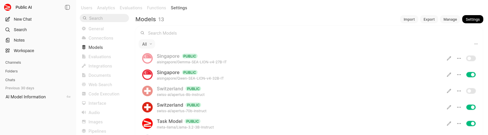
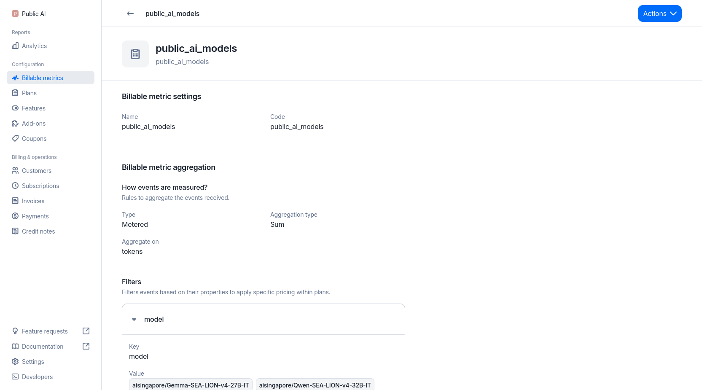

Working in ``charts/web_services/charts/litellm/templates/deployment.yaml``

Add a section to ``env`` for the API key.

```yaml
          env:
            - name: NEW_PROVIDER_API_KEY
              valueFrom:
                secretKeyRef:
                  name: {{ .Values.secrets.name }}
                  key: new_provider_api_key
```
## Create a new model endpoint and pricing for LiteLLM
Working in ``charts/web_services/charts/litellm/values.yaml``

```yaml
  models:
    - model_name: new-provider/apertus-8b-instruct
      litellm_params:
        model: openai/inference-apertus-8b
        api_base: https://api.newprovider.com/v1
        api_key: "os.environ/NEW_PROVIDER_API_KEY"
        supports_vision: true  
        weight: 20
        temperature: 0.8
        top_p: 0.9
        max_tokens: 16384
      model_info:
        input_cost_per_token: 0.00000010  # $0.10 per 1M tokens
        output_cost_per_token: 0.00000020  # $0.20 per 1M tokens

...
# Also add a line to declare the secrets configuration:
secrets:
  name: litellm-secrets
  litellmMasterKey: ""
  litellmSaltKey: ""
  ...
  new_provider_api_key: ""
```

## Add the API key to the deployment script

``web.sh``
This part of the script checks for missing env vars
```bash
    local required_vars=(
        "LICENSE_KEY"
        "WEBUI_SECRET_KEY"
        "OWUI_DATABASE_URL"
        ...
        "NEW_PROVIDER_API_KEY"
```

```bash
# Function to deploy web services
deploy_services() {
    echo "🔧 Building web services dependencies..."
    helm dependency build charts/web_services/

    echo "📦 Deploying web services with Lago billing..."
    helm upgrade --install web-services charts/web_services/ \
        -n web-services \
        --create-namespace \
        --set open-webui.secrets.licenseKey="$LICENSE_KEY" \
        --set open-webui.secrets.webuiSecretKey="$WEBUI_SECRET_KEY" \
        ...
        --set open-webui.secrets.newProviderApiKey="$NEW_PROVIDER_API_KEY"
```

## Configure the callback to Lago billing engine
Working in ``charts/web_services/charts/litellm/custom_lago_callback.py``
```bash
    def _normalize_model_name(self, model: str) -> str:
        """
        Normalize model names to match Lago billing codes.
        Maps internal LiteLLM model names to user-facing model names.
        """
        # Model name mapping: litellm model -> lago billing name
        model_mapping = {
            # Apertus models (various endpoints with version suffixes)
            "Apertus-8B-Instruct-2509": "swiss-ai/apertus-8b-instruct",
            "swiss-ai/Apertus-8B-Instruct-2509": "swiss-ai/apertus-8b-instruct",
            "apertus-8b-instruct": "swiss-ai/apertus-8b-instruct",
            
            "NewProvider-8B-Instruct-2509": "new-provider/apertus-8b-instruct",
```

## Configure OpenWebUI

Go to the OpenWebUI admin panel and configure.


## Check Lagos configuration
Cofirm Lagos has detected the model and pricing.


