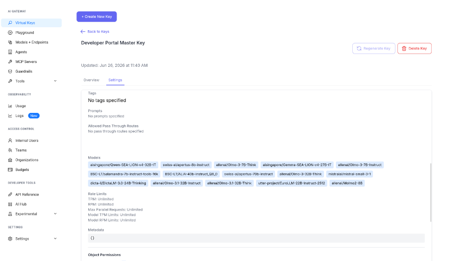
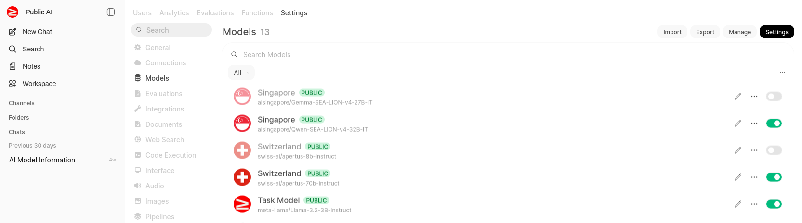
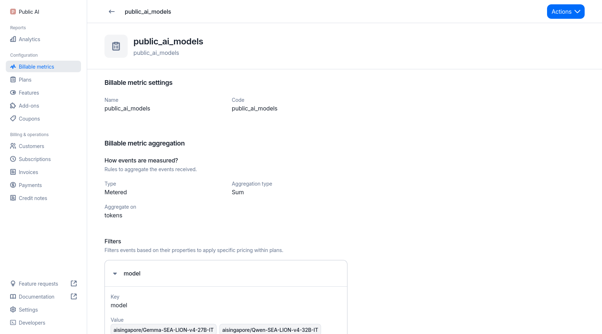

# Intro
Models are stored in here: ``charts/platform/charts/litellm/models``.
Each model has a file, and where there are multiple provider endpoints, they all exist in that file.

## Fallbacks
When adding a model please use at least two fallbacks, ideally from unrelated suppliers.

# Edit code
To add a new model to LiteLLM, there are three main parts to configure: defining the model YAML, configuring the secret & environment variable, and adding billing name mapping in the Lago callback.

### 1. Define the Model YAML
Create a new YAML file (or update an existing one) under [`charts/platform/charts/litellm/models/`](/charts/platform/charts/litellm/models) organized by provider (for example: [`charts/platform/charts/litellm/models/<provider>/<model-name>.yaml`](/charts/platform/charts/litellm/models)).

> [!NOTE]
> The LiteLLM ConfigMap template in [`configmap.yaml`](/charts/platform/charts/litellm/templates/configmap.yaml#L123-L178) dynamically globs all `models/**/*.yaml` files and filters them against `environments` (`staging` / `prod`).

**Example Model YAML:**
```yaml
environments:
  - staging
  - prod
models:
- model_name: provider/my-new-model
  litellm_params:
    model: openai/provider/my-new-model
    api_base: https://api.provider.example.com/v1
    api_key: os.environ/MY_PROVIDER_API_KEY
    ssl_verify: false
    supports_vision: false
    temperature: 1.0
    top_p: 0.95
    max_tokens: 16384
  model_info:
    input_cost_per_token: 0.00000085
    output_cost_per_token: 0.00000040
fallbacks:
- speakleash/Bielik-11B-v3.0-Instruct
```

### 2. Configure the Secret & Environment Variable

If the model requires an API key secret referenced via `os.environ/MY_PROVIDER_API_KEY`, wire it through AWS Secrets Manager and Kubernetes:

1. **AWS Secrets Manager**:
   - Add the key/value `MY_PROVIDER_API_KEY` to the Secrets Manager secret (e.g., `staging/aichat/litellm/manual-secrets` and `prod/publicai/litellm/manual-secrets`).
2. **ExternalSecret Definition** in [`secrets.yaml`](/charts/platform/charts/litellm/templates/secrets.yaml):
   - Map the secret in `spec.target.template.data`:
     ```yaml
     my_provider_api_key: '{{ "{{ .MY_PROVIDER_API_KEY }}" }}'
     ```
   - Reference the secret from `manualSecretsName` in `spec.data`:
     ```yaml
     - secretKey: MY_PROVIDER_API_KEY
       remoteRef:
         key: {{ .Values.secrets.manualSecretsName }}
         property: MY_PROVIDER_API_KEY
     ```
3. **Container Environment Variable** in [`deployment.yaml`](/charts/platform/charts/litellm/templates/deployment.yaml#L69-L119):
   - Expose the secret to LiteLLM's environment:
     ```yaml
     - name: MY_PROVIDER_API_KEY
       valueFrom:
         secretKeyRef:
           name: {{ .Values.secrets.name }}
           key: my_provider_api_key
           optional: true
     ```
4. *(Optional)* If the model is tested in the health-check job, also add the key to [`health-check-secrets.yaml`](/charts/platform/templates/health-check-secrets.yaml#L15-L39).


### 3. Update Lago Billing Mapping
Update [`custom_lago_callback.py`](/charts/platform/charts/litellm/custom_lago_callback.py) so Lago tracks token usage with the correct billing code.

In [`_normalize_model_name`](/charts/platform/charts/litellm/custom_lago_callback.py#L85-L165), add mappings for both the LiteLLM internal model string and any aliases to the user-facing/billing model name:

```python
# In model_mapping dictionary:
"openai/provider/my-new-model": "provider/my-new-model",
"provider/my-new-model": "provider/my-new-model",
```

### Summary Checklist

| Step | File | Purpose |
| :--- | :--- | :--- |
| **1. Model Config** | [`models/<provider>/<model>.yaml`](/charts/platform/charts/litellm/models) | Defines model params, pricing, fallbacks, and target envs |
| **2. Secret Mapping** | [`secrets.yaml`](/charts/platform/charts/litellm/templates/secrets.yaml) | Pulls API key from AWS Secrets Manager via ExternalSecret |
| **3. Container Env** | [`deployment.yaml`](/charts/platform/charts/litellm/templates/deployment.yaml) | Exposes `MY_PROVIDER_API_KEY` to the LiteLLM container |
| **4. Billing Normalization** | [`custom_lago_callback.py`](/charts/platform/charts/litellm/custom_lago_callback.py) | Maps model name to Lago billing event code |

# Pre deploy check
Run this code test to make sure the model code is valid and will work with LiteLLM

```
python3 health-check/model-code-check.py
```

# Deploy the code
Push to ``dev`` branch wait for argo to pick it up, if the model doesn't appear restart the LiteLLM deployment in Argo or use kubectl.

## Test
1. Once all rolled out test litellm ``python health-check/litellm.py --staging``, check that you see all the models you expect to and that they all return success.
2. Login into api-internal.staging.chat and use the playground to check the model. 

## Production
Push to ``main`` and repeat for production.


# Configure Apps

## Configure LiteLLM
To allow zuplo to access the new models they need to be added to the developer portal API key allowed list.

Go to api-internal.publicai.co > Virtual Keys. Open the Developer Portal Master Key > go to Edit > Select the new models from the list.



## Configure OpenWebUI

Go to the OpenWebUI admin panel and configure.


## Check Lagos configuration
Cofirm Lagos has detected the model and pricing.




# Deploy to Hugging face
Read the hugging face docs here: [hugging face](huggingface.md)

