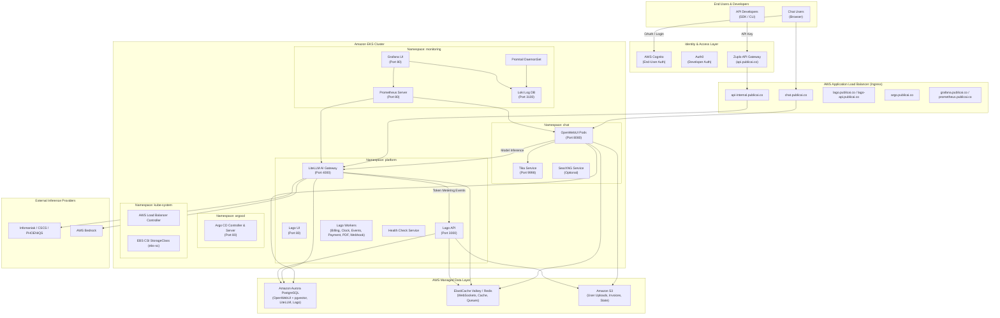
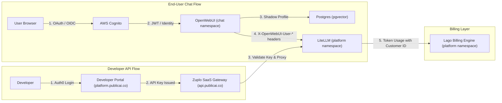

# Public AI System Architecture & GitOps Guide

Welcome to the team! This repository contains the complete Infrastructure-as-Code (IaC), Kubernetes Helm charts, and Argo CD GitOps definitions that deploy and operate the Public AI platform on Amazon Elastic Kubernetes Service (EKS).

As a developer or operator, this document provides the canonical overview of our infrastructure environments, GitOps deployment lifecycle, Kubernetes namespace topology, Helm chart architecture, authentication flows, and model routing.

---

## 🏗 System Architecture Overview



---

## 🌍 Infrastructure as Code (Terraform)

Our cloud infrastructure is partitioned into two distinct workspaces targeting different AWS accounts, regions, and environments.

| Environment | Repository Directory | AWS Region | EKS Cluster Name | Primary Domain | Deployment Trigger | GitHub Workflow |
| :--- | :--- | :--- | :--- | :--- | :--- | :--- |
| **Staging** | [`/terraform`](file:///home/jungle/chat.publicai.co/terraform) | `us-east-1` (N. Virginia) | `staging-main-cluster` | `ai-staging.chat` | Release tag matching `v*` (e.g., `v0.0.5`, `v1.0.0`) | [staging-terraform.yaml](file:///home/jungle/chat.publicai.co/.github/workflows/staging-terraform.yaml) |
| **Production** | [`/terraform_publicai`](file:///home/jungle/chat.publicai.co/terraform_publicai) | `eu-central-2` (Zurich) | `prod-main-cluster` | `publicai.co` | Release tag matching `prod-v*` (e.g., `prod-v0.0.5`) | [production-terraform.yaml](file:///home/jungle/chat.publicai.co/.github/workflows/production-terraform.yaml) |

### 1. Staging (`/terraform`)
* **Purpose**: Sandbox and staging environment for testing infrastructure changes, database migrations, and pre-production workloads.
* **Deployment Workflow**:
  1. Create a GitHub Release with a tag matching `v*` (e.g., `v0.1.2`).
  2. The GitHub Action runs `terraform init`, `validate`, `plan`, and `apply -auto-approve`.
  3. Updates kubeconfig for `staging-main-cluster` in `us-east-1`.
  4. Automatically bootstraps the cluster GitOps root application by applying `kubectl apply -f argo/bootstrap/staging-bootstrap.yaml`.

### 2. Production (`/terraform_publicai`)
* **Purpose**: High-availability production environment hosting public traffic, developer APIs, and billing services.
* **Deployment Workflow**:
  1. Create a GitHub Release with a tag containing `prod-` matching `prod-v*` (e.g., `prod-v0.0.5`).
  2. The GitHub Action runs `terraform init`, `validate`, `plan`, and `apply -auto-approve` within `terraform_publicai/`.
  3. Updates kubeconfig for `prod-main-cluster` in `eu-central-2`.
  4. Automatically bootstraps the cluster GitOps root application by applying `kubectl apply -f argo/bootstrap/production-bootstrap.yaml`.

### What Terraform Provisions
* **Networking**: VPC, Public & Private Subnets across 2 Availability Zones, Internet Gateways, NAT Gateways, Route Tables, and Route53 DNS records.
* **Compute**: EKS Cluster (Control Plane + Managed Worker Node Groups), IAM OIDC Identity Providers, and IRSA Roles.
* **Data Layer**: Amazon Aurora PostgreSQL (Serverless v2 / KMS encrypted), ElastiCache Valkey/Redis clusters, S3 buckets, and Secrets Manager.
* **Authentication**: AWS Cognito User Pool with Google OAuth integration, SES email verification, and pre-signup Lambda triggers.
* **Core In-Cluster Controllers**: Bootstraps the Argo CD Helm release and namespace.

---

## 🐙 GitOps & Argo CD Architecture (`/argo`)

We follow a **declarative, pull-based GitOps model** using Argo CD's **App-of-Apps** pattern. Once the root bootstrap application is applied via Terraform, Argo CD reconciles all in-cluster state directly from this Git repository.

```
argo/
├── bootstrap/
│   ├── staging-bootstrap.yaml         # Root Application for Staging (points to argo/bootstrap/staging)
│   ├── production-bootstrap.yaml      # Root Application for Production (points to argo/bootstrap/production)
│   ├── staging/                       # Child Application Definitions for Staging
│   │   ├── publicai-apps.yaml         # App-of-Apps pointing to argo/apps/staging
│   │   └── currentai-apps.yaml
│   └── production/                    # Child Application Definitions for Production
│       ├── publicai-apps.yaml         # App-of-Apps pointing to argo/apps/production
│       └── currentai-apps.yaml
├── apps/
│   ├── staging/                       # Application CRDs for Staging (targetRevision: dev)
│   └── production/                    # Application CRDs for Production (targetRevision: main)
└── environments/
    ├── staging/                       # Environment-specific Helm values overrides
    └── prod/                          # Environment-specific Helm values overrides
```

### Git Branching & Synchronization Strategy
* **Staging Applications** (`argo/apps/staging/`): Sync continuously against the **`dev`** branch.
* **Production Applications** (`argo/apps/production/`): Sync continuously against the **`main`** branch.
* **Sync Policy**: Automated with `prune: true`, `selfHeal: true`, and `CreateNamespace=true`.

### Sync Waves & Deployment Ordering
Argo CD uses `argocd.argoproj.io/sync-wave` annotations to ensure dependent infrastructure components are fully operational before applications start:

| Sync Wave | Applications Deployed | Namespace | Purpose |
| :---: | :--- | :--- | :--- |
| **Wave 0** | `load-balancer`, `storage-class` | `kube-system` | AWS Load Balancer Controller and EBS CSI storage classes |
| **Wave 1** | `monitoring-resources` | `monitoring` | Prometheus Custom Resource Definitions, RBAC, and Dashboards |
| **Wave 2** | `platform`, `prometheus`, `grafana`, `loki`, `promtail` | `platform`, `monitoring` | LiteLLM, Lago billing stack, and observability TSDBs/collectors |
| **Wave 3** | `chat`, `ingress` | `chat`, `web-services` | OpenWebUI chat frontend, Tika, and public Ingress ALB rules |

---

## 🏷 Kubernetes Namespaces & Workloads

The cluster is cleanly segmented into dedicated namespaces to enforce resource isolation, RBAC policies, and distinct scaling profiles:

| Namespace | Key Services & Deployments | Storage / State | Scaling Profile |
| :--- | :--- | :--- | :--- |
| **`chat`** | • `openwebui-service` (Port 8080)<br/>• `tika-service` (Port 9998)<br/>• `searxng-service` (Port 8080) | S3 (`uploads/`), Aurora PostgreSQL, Valkey Redis | HPA Autoscaling: 1-3 replicas (75% CPU / 85% Memory) |
| **`platform`** | • `litellm-service` (Port 4000)<br/>• `platform-front-svc` (Port 80)<br/>• `platform-api-svc` (Port 3000)<br/>• Lago Workers (Billing, Clock, Events, Payment, PDF, Webhook)<br/>• `health-check` service | Aurora PostgreSQL, Valkey Redis, S3 (PDF invoices) | LiteLLM HPA: 1-3 replicas. Lago workers scaled individually. |
| **`monitoring`** | • `prometheus-server` (Port 80)<br/>• `grafana` (Port 80)<br/>• `loki` (Port 3100)<br/>• `promtail` (DaemonSet) | EBS CSI Volume (`ebs-sc`) for Loki (10Gi) | 1 replica (Prometheus TSDB, Grafana, Loki SingleBinary) + Promtail DaemonSet on every node |
| **`kube-system`** | • AWS Load Balancer Controller<br/>• StorageClass (`ebs-sc`) | AWS API | 1-2 replicas running with IRSA permissions |
| **`argocd`** | • `argocd-server` (Port 80)<br/>• `argocd-repo-server`<br/>• `argocd-application-controller` | In-cluster GitOps state | Managed by Argo CD Helm chart |
| **`web-services`** | • Centralized Ingress definition host namespace | N/A (Routing Layer) | Managed by AWS ALB Controller |

---

## 📦 Helm Charts Architecture (`/charts`)

Application definitions are organized under [`/charts`](file:///home/jungle/chat.publicai.co/charts) as reusable, modular Helm charts:

```
charts/
├── chat/                      # Umbrella chart for the end-user chat interface
│   ├── charts/
│   │   ├── open-webui/        # OpenWebUI frontend chart
│   │   ├── tika/              # Apache Tika document text extraction
│   │   └── searxng/           # SearXNG metasearch engine (disabled by default)
│   └── templates/
│       └── db-initializer.yaml# Database initialization job for OpenWebUI pgvector
├── platform/                  # Umbrella chart for core AI and billing services
│   ├── charts/
│   │   ├── litellm/           # LiteLLM AI Gateway, custom auth & Lago callbacks
│   │   │   └── models/        # Modular per-vendor model YAML definitions
│   │   └── lago/              # Lago metering & billing platform (upstream sub-chart)
│   └── templates/
│       ├── health-check-*.yaml# Health-check deployment, service, and secrets
│       ├── db-initializer.yaml# Database migration/seed jobs
│       └── lago-*.yaml        # Lago secrets and service account patches
├── ingress/                   # Centralized multi-host AWS Application Load Balancer Ingress
├── load-balancer/             # AWS Load Balancer Controller chart
├── monitoring-resources/      # Dashboards ConfigMaps, scrape configs, and RBAC
└── storage-class/             # AWS EBS CSI StorageClass definitions
```

### Upstream Charts Managed via Argo CD
Instead of committing vendor charts into git, monitoring workloads are pulled directly from upstream Helm repositories by Argo CD:
* **Prometheus**: Sourced from `prometheus-community/prometheus` (version `29.17.0`)
* **Grafana**: Sourced from `grafana/grafana` (version `10.5.15`)
* **Loki**: Sourced from `grafana/loki` (version `7.0.0`)
* **Promtail**: Sourced from `grafana/promtail` (version `6.17.1`)

---

## 🌐 Ingress & Public Routing

Public traffic enters through AWS Application Load Balancers provisioned by the AWS Load Balancer Controller using the `alb` IngressClass. Traffic is routed in **IP-mode** directly from the ALB to the Pod IPs, bypassing `kube-proxy` for minimal latency.

### Hostname Routing Matrix

| Public Hostname (Production) | Public Hostname (Staging) | Target Kubernetes Service | Target Namespace | Target Port | Description |
| :--- | :--- | :--- | :--- | :---: | :--- |
| `chat.publicai.co` | `chat.ai-staging.chat` | `openwebui-service` | `chat` | 8080 | OpenWebUI Chat Frontend |
| `api-internal.publicai.co` | `api-internal.ai-staging.chat` | `litellm-service` | `platform` | 4000 | LiteLLM AI Gateway (Zuplo upstream) |
| `lago.publicai.co` | `lago.ai-staging.chat` | `platform-front-svc` | `platform` | 80 | Lago Billing Admin Dashboard |
| `lago-api.publicai.co` | `lago-api.ai-staging.chat` | `platform-api-svc` | `platform` | 3000 | Lago Billing API & Webhooks |
| `argo.publicai.co` | `argo.ai-staging.chat` | `argocd-server` | `argocd` | 80 | Argo CD GitOps Dashboard |
| `grafana.publicai.co` | `grafana.ai-staging.chat` | `grafana` | `monitoring` | 80 | Grafana Observability Dashboards |
| `prometheus.publicai.co` | `prometheus.ai-staging.chat` | `prometheus-server` | `monitoring` | 80 | Prometheus Metric Server UI |

---

## 🔐 Authentication & Identity Architecture

We strictly decouple end-user authentication from developer API authentication:



### 1. End Users (Chat Web UI)
* **Identity Provider**: **AWS Cognito**
* **Flow**: When a user logs in at `chat.publicai.co`, OpenWebUI handles the OAuth2/OIDC flow with AWS Cognito. OpenWebUI creates a shadow profile in its PostgreSQL database mapped to the Cognito unique user ID.
* **Header Propagation**: OpenWebUI passes the user's identity to LiteLLM via `X-OpenWebUI-User-*` headers for per-user token attribution.

### 2. Developers (API & Platform)
* **Identity Provider**: **Auth0**
* **Flow**: Developers access the developer portal at `platform.publicai.co` (built with Zudoku) using Auth0. They generate API keys managed by our SaaS API gateway, **Zuplo** (`api.publicai.co`).
* **Gateway Proxy**: Zuplo enforces rate limits, validates keys, and proxies authenticated requests to our internal LiteLLM ingress (`api-internal.publicai.co`).

### 3. Billing & Metering Convergence (Lago)
Cognito and Auth0 identities remain disjoint until they reach **LiteLLM**. LiteLLM uses `custom_lago_callback.py` to intercept completion responses and asynchronously report prompt/completion token usage to Lago (`platform-api-svc`), linking usage to the caller's unique `external_customer_id`.

---

## 🤖 AI Gateway & Model Routing (LiteLLM)

LiteLLM sits in the `platform` namespace and serves as the unified API gateway and router for all LLM inference.

### 1. Dynamic Model Discovery
OpenWebUI does not hardcode backend models. On initialization and page refresh, it queries LiteLLM's standard OpenAI-compatible `/v1/models` endpoint. LiteLLM responds with the list of configured models to dynamically populate the UI dropdown.

### 2. Modular Model Configurations
Model definitions are modularized under `charts/platform/charts/litellm/models/<vendor>/<model>.yaml`:
* [`swiss-ai`](file:///home/jungle/chat.publicai.co/charts/platform/charts/litellm/models/swiss-ai): Models such as `apertus-70b-instruct` routed to Infomaniak, CSCS, or PHOENIQS.
* [`speakleash`](file:///home/jungle/chat.publicai.co/charts/platform/charts/litellm/models/speakleash): `Bielik-11B-v3.0-Instruct`.
* [`google`](file:///home/jungle/chat.publicai.co/charts/platform/charts/litellm/models/google), [`nvidia`](file:///home/jungle/chat.publicai.co/charts/platform/charts/litellm/models/nvidia), [`allenai`](file:///home/jungle/chat.publicai.co/charts/platform/charts/litellm/models/allenai), [`aisingapore`](file:///home/jungle/chat.publicai.co/charts/platform/charts/litellm/models/aisingapore), [`cohere`](file:///home/jungle/chat.publicai.co/charts/platform/charts/litellm/models/cohere), [`moonshotai`](file:///home/jungle/chat.publicai.co/charts/platform/charts/litellm/models/moonshotai), [`utter-project`](file:///home/jungle/chat.publicai.co/charts/platform/charts/litellm/models/utter-project), and [`zai-org`](file:///home/jungle/chat.publicai.co/charts/platform/charts/litellm/models/zai-org).

### 3. Load Balancing & Resilience
LiteLLM is configured with `router.routingStrategy: simple-shuffle`. Multiple endpoints for the same model name are automatically load-balanced. If an inference partner experiences latency spikes or downtime, LiteLLM manages retries, failovers, and cooldown windows transparently.

---

## 🗄️ AWS Managed Data Layer & Persistence

We maintain zero stateful databases inside Kubernetes pods. All durable state is delegated to AWS managed services:

1. **Amazon Aurora PostgreSQL**:
   * **OpenWebUI Database**: Stores user shadow accounts, chat history, system prompts, settings, and vector embeddings via the `pgvector` extension.
   * **LiteLLM Database**: Stores API keys, team mappings, user budgets, and request metadata via Prisma.
   * **Lago Database**: Stores invoicing rules, subscription plans, customer profiles, and billing ledgers.
2. **Amazon ElastiCache (Valkey / Redis)**:
   * **OpenWebUI**: Synchronizes WebSockets across replicas for real-time streaming responses.
   * **LiteLLM**: Provides low-latency response caching and sliding-window rate limiting.
   * **Lago**: Manages background job queues for billing, events, webhooks, and PDF workers.
3. **Amazon S3**:
   * **Chat Uploads**: User documents, images, and attachments stored under the `uploads/` prefix.
   * **Billing Assets**: Generated PDF invoices from Lago.
   * **Terraform State**: Remote state storage with DynamoDB state locking.
4. **AWS EBS Volumes (CSI Driver)**:
   * **Loki**: Persistent storage for indexed logs using the `ebs-sc` StorageClass.

---

## 🛠 Developer Cheat Sheet & Operational Workflows

### 1. Triggering Infrastructure Deployments (Terraform)
* **Deploy Staging**: Create a GitHub Release with tag `vX.Y.Z` (e.g. `v0.1.0`).
* **Deploy Production**: Create a GitHub Release with tag `prod-vX.Y.Z` (e.g. `prod-v0.0.5`).

### 2. Triggering Application & Chart Deployments (GitOps)
* **Deploy to Staging**: Push or merge changes to the **`dev`** branch. Argo CD syncs within ~3 minutes (or sync manually via the UI).
* **Deploy to Production**: Push or merge changes to the **`main`** branch.

### 3. Connecting to the EKS Clusters
```bash
# Staging (us-east-1)
aws eks update-kubeconfig --region us-east-1 --name staging-main-cluster

# Production (eu-central-2)
aws eks update-kubeconfig --region eu-central-2 --name prod-main-cluster
```

### 4. Restarting Services After Config Changes
If a configuration change or secret requires a forced pod reload:
```bash
# Restart LiteLLM AI Gateway
kubectl rollout restart deployment/litellm -n platform

# Restart OpenWebUI
kubectl rollout restart deployment/open-webui -n chat

# Restart Lago Workers or API
kubectl rollout restart deployment/platform-api -n platform
kubectl rollout restart deployment/platform-worker -n platform
```

### 5. Running Health Check & Supplier Tests
Run the health-check test suite locally or in CI (ensure credentials from Doppler are loaded):
```bash
cd health-check
python suppliers.py   # Validates external inference provider health
python litellm.py     # Validates internal LiteLLM gateway routing & models
```
